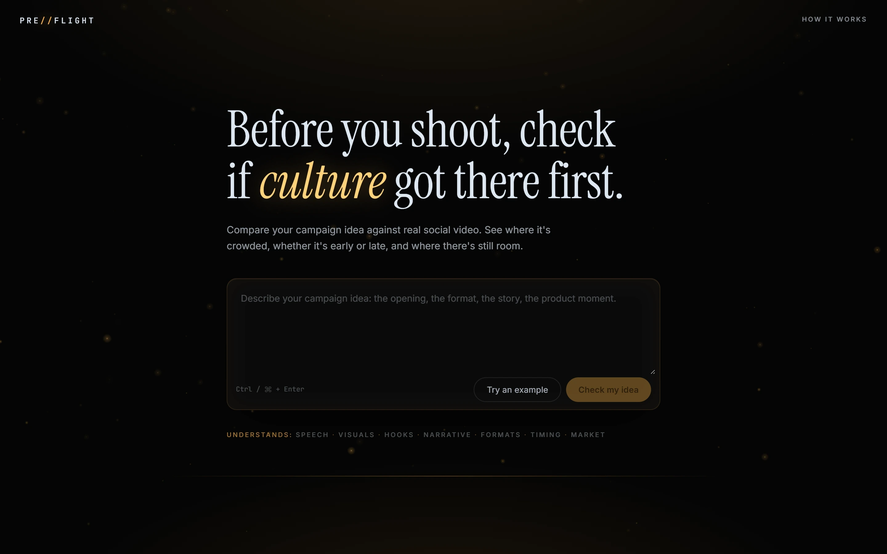
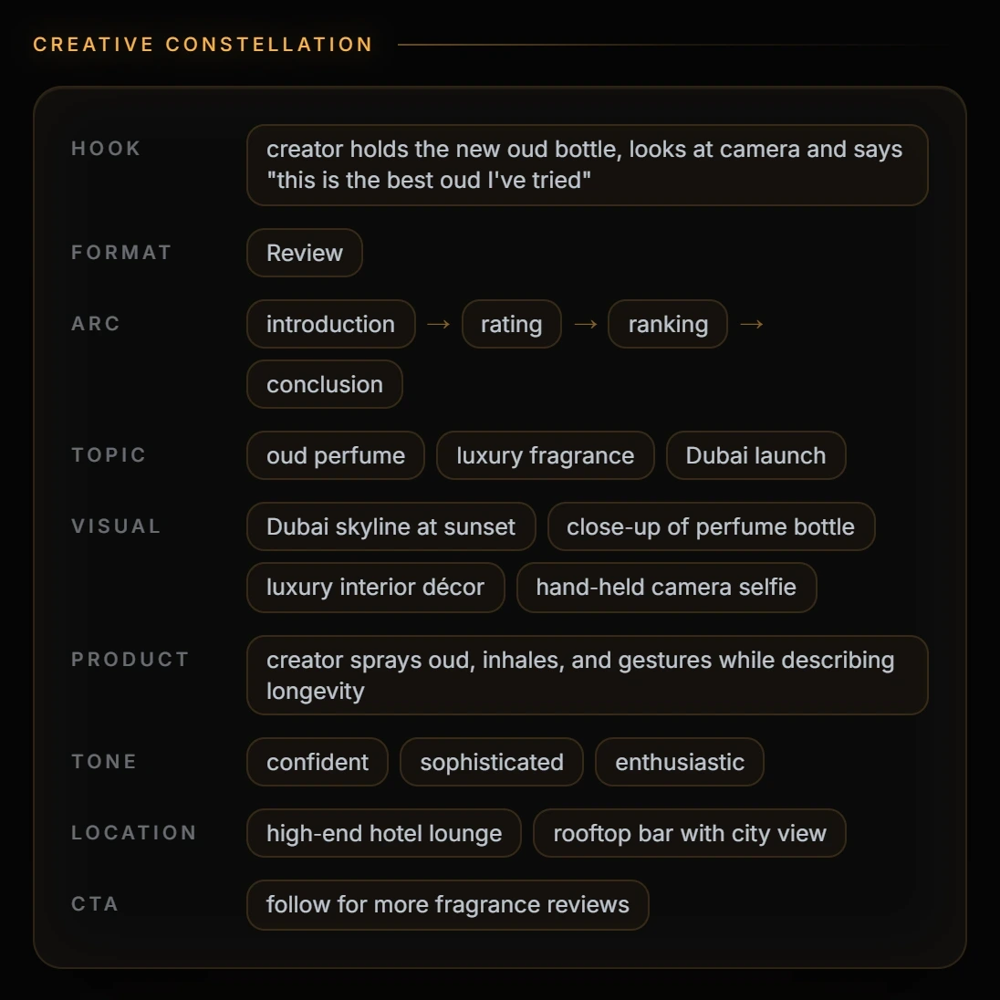
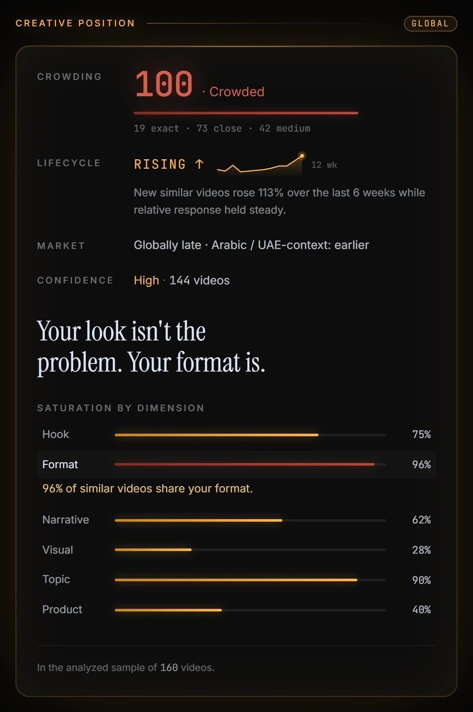
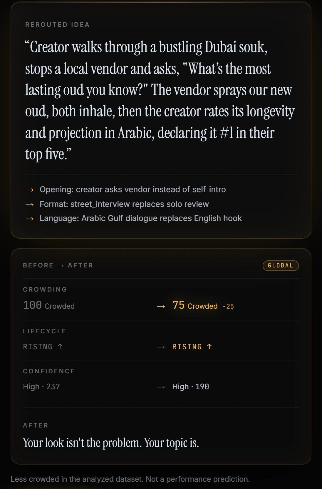
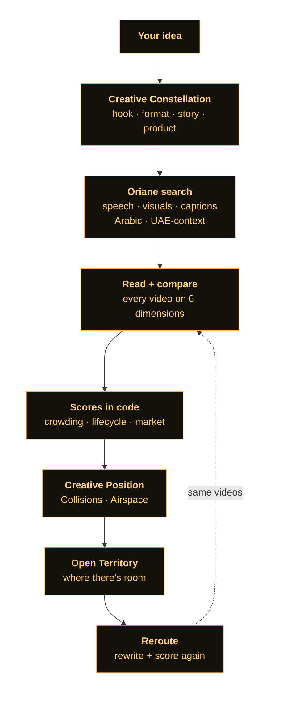

<div align="center">

# PRE//FLIGHT

### Before you shoot, check if culture got there first.

Preflight tells brands where a campaign idea sits in **real social video**, whether it's **early or late**,<br/>and **where there's still room**, before they spend money producing it.




<sub>Built at the Oriane x Replit "Build for the Video Economy" hackathon · Dubai</sub>

</div>

---

## The problem

Brands and agencies spend real money on creator campaigns and approve ideas on gut feeling. Nobody checks:

- Has this video **already been made** hundreds of times?
- Is the format **rising or fading**?
- Is it crowded **globally** but still **open locally**?

Preflight answers those questions in minutes, with real videos as proof.

## How it works

| 1 · Paste your idea | 2 · See where it sits | 3 · Move to open space |
| :-- | :-- | :-- |
| One or two sentences about the campaign: the opening, the format, the story, the product moment. | Preflight searches real Instagram and TikTok videos with **Oriane** and measures how crowded your idea already is. | **Reroute** rewrites the idea toward the gap the data shows, then scores it again on the same videos. |

> Oriane sees the videos. The language model reads and labels them. **Every number is computed in code.**

## What you get

<table>
  <tr>
    <td width="50%" valign="top">
      
      <p><b>Creative Constellation</b><br/>The stars your idea is made of: hook, format, story arc, visuals, product moment, tone, location.</p>
    </td>
    <td width="50%" valign="top">
      
      <p><b>Creative Position</b><br/>One card with the verdict: Crowding, Lifecycle, Market and Confidence, plus which part of the idea is the problem.</p>
    </td>
  </tr>
</table>

| | What it shows |
| :-- | :-- |
| **Collisions** | The real videos closest to your idea, with the exact line and timestamp that proves it. |
| **Creative Airspace** | A 3D galaxy where every screen is a real video and your idea is the golden star. Switch Global · Arabic · UAE-context and watch the crowd change. |
| **Open Territory** | Where the data shows room: a less crowded format, or a market where the same idea is far less crowded. |
| **Reroute** | Rewrites the idea toward that territory and shows a fair before / after, scored on the same videos. |
| **Replit visual example** | An animated concept preview of the rerouted idea, made with Replit, so the team can see what to shoot. |

## Example: a luxury oud launch in Dubai (real data)

> *"A creator reviews our new oud to camera, rates it on longevity and projection, and ranks it number one in their top 5 oud perfumes."*

1. **Oriane** returns **160 real videos**. Preflight finds **19 near-identical** and **73 close** matches.
2. **Crowding 100 · Crowded**, and still **rising** (+113% new similar videos in six weeks). Globally late, but earlier in Arabic and UAE content.
3. The insight: *"Your look isn't the problem. Your format is."* 96% of similar videos use the same review format.
4. In **Arabic-language content** the same idea scores **38**, so Open Territory recommends **Arabic-first**.
5. **Reroute** turns it into a Gulf-Arabic street interview in a Dubai souk. On the same 314 videos, crowding falls **100 → 75** globally and **92 → 24** in Arabic.

<div align="center">
  
</div>

<p align="center"><i>Less crowded in the analyzed dataset. Not a performance prediction.</i></p>

## Under the hood



- **Oriane** is the perception layer: it searches what people **say** (transcripts), what's **seen** (AI Vision on frames) and what's **written** (captions, hashtags), plus language and location.
- **Preflight** is the decision layer: it turns those videos into crowding, timing and room to move.
- Every Oriane and model response is **cached**, so repeat runs are free and the demo works offline.

<details>
<summary><b>How the scores are calculated</b></summary>

<br/>

- **Similarity per video** = 0.25 hook + 0.20 narrative + 0.20 visual + 0.15 format + 0.10 topic + 0.10 product. The comparison step grades each dimension A to E; code maps the grades to numbers.
- **Crowding (0 to 100)** = round(100 × (0.5 × min(1, exact / 8) + 0.3 × min(1, close / 20) + 0.2 × min(1, medium / 40))), where exact ≥ 0.85, close 0.70 to 0.85, medium 0.55 to 0.70.
- **Dimension saturation** = among related videos (similarity ≥ 0.4), the share where that dimension is ≥ 0.7.
- **Confidence**: 80+ related videos is High, 30 to 79 Medium, under 30 Low. The count is always shown.
- **Lifecycle** looks at similar videos over the last 12 weeks: how fast new ones are appearing, and whether their response (views ÷ followers, compared with videos of the same age) is rising or falling. Stages: EARLY, RISING, PEAKING, STEADY, DECLINING, EXHAUSTED, or INSUFFICIENT DATA below 12 dated videos.
- **Market**: Arabic uses Oriane's language field. UAE-context uses tagged location or mentions like Dubai, Abu Dhabi, UAE, دبي, الإمارات. Each market is scored separately and small samples say "Low data".
- **Open Territory**: a format in the same topic with fewer videos and at least 1.2× typical response, or a market where the idea is at least 25 points less crowded.

All constants live in [`lib/config.ts`](lib/config.ts). Field details from the Oriane API are in [`docs/oriane-fields.md`](docs/oriane-fields.md).

</details>

## Run it yourself

```bash
npm install
cp .env.example .env.local   # add your Oriane and LLM keys
npm run dev                  # http://localhost:3000
```

Open the app and click **Try an example**, or type your own idea and click **Check my idea**.

<details>
<summary><b>Environment variables</b></summary>

<br/>

| Name | What it's for |
| :-- | :-- |
| `ORIANE_API_KEY` | Oriane API key. Several comma-separated keys are allowed; the next one takes over when a key runs out of credits. |
| `LLM_PROVIDER` | `groq` (default), `gemini`, `anthropic` or `openai` |
| `LLM_API_KEY` | Key for that provider. Several comma-separated keys are pooled for more speed. |
| `LLM_MODEL` | Optional. Otherwise a model is picked from the provider's live model list. |
| `ORIANE_MAX_CALLS_PER_RUN` | Safety cap on Oriane calls per run (default 40). |
| `PREFLIGHT_POOL_MAX` | Videos analysed per idea (default 160). |
| `PREFLIGHT_OFFLINE` | `1` = use saved results only, no network calls. |

Keys live in `.env.local` or Replit Secrets and are never committed.

</details>

<details>
<summary><b>Deploy on Replit</b></summary>

<br/>

1. Replit → **Create App** → **Import from GitHub** → this repo.
2. Add the environment variables above in **Secrets**.
3. Press **Run** to test, then **Publish**. The build and start commands are already in `.replit`.

Useful scripts: `npm run preflight -- "your idea"` runs an idea from the terminal (add `--reroute` to also reroute), `npm run cache:pack` / `npm run cache:unpack` move saved results between machines.

</details>

## Demo

- 2-minute demo video: [script and voice-over](docs/demo-video-script.md) · [subtitles](docs/demo-video.srt)

## Honest limits

- It's a **sample**: the videos Oriane returns for your idea (Instagram and TikTok, roughly the last 13 weeks), not every video on the internet.
- It's **not a performance prediction**. "Less crowded in the analyzed dataset" is the claim, nothing more.
- Oriane gives no visual tags, so the visual comparison reads captions and transcripts, and uses Oriane's visual search to find matches.
- Location is sparse, so UAE-context also counts videos that mention the UAE, and it's always called "UAE-context content".

## Built with

[Oriane](https://www.oriane.xyz) (video search and perception) · [Replit](https://replit.com) (hosting and animated concept previews) · Next.js 16 · React Three Fiber · GSAP · Framer Motion · Tailwind CSS · Zod

<div align="center">
<br/>
Made in Dubai by <b>Bilal</b>, <b>Umar</b> and <b>Fuad</b>.
</div>
